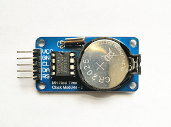

# ds1302-rs

DS1302 real time clock-calendar platform agnostic driver
 
   This Rust library provides an interface for interacting with ds1302 RTC using the rp2040-hal or rp235x-hal.

 # About

The DS1302 trickle-charge timekeeping chip contains a real-time clock/calendar and 31 bytes of static RAM. It
communicates with a microprocessor via a simple serial interface. The real-time clock/calendar provides seconds,
minutes, hours, day, date, month, and year information. The end of the month date is automatically adjusted for
months with fewer than 31 days, including corrections for leap year. The clock operates in either the 24-hour or
12-hour format with an AM/PM indicator. The chip driver is based on [`embedded-hal`] traits.

Datasheet: [DS1302](https://www.analog.com/media/en/technical-documentation/data-sheets/ds1302.pdf)

                        
DS1302 RTC Board
 
 [`embedded-hal`]: https://github.com/rust-embedded/embedded-hal

## Crate features

* `rp2040` - use to enabled raspberry pico support (default features)
* `rp2350` - use to enabled raspberry pico2 support 

## Examples
https://github.com/sndnvaps/ds1302-drv/tree/main/examples/pico2-display-rtc
https://github.com/sndnvaps/ds1302-drv/tree/main/examples/pico-display-rtc

## License

Licensed under either of

- Apache License, Version 2.0 ([LICENSE-APACHE](LICENSE-APACHE) or
  http://www.apache.org/licenses/LICENSE-2.0)
- MIT license ([LICENSE-MIT](LICENSE-MIT) or http://opensource.org/licenses/MIT)

at your option.

### Contribution

Unless you explicitly state otherwise, any contribution intentionally submitted for inclusion in the
work by you, as defined in the Apache-2.0 license, shall be dual licensed as above, without any
additional terms or conditions.
